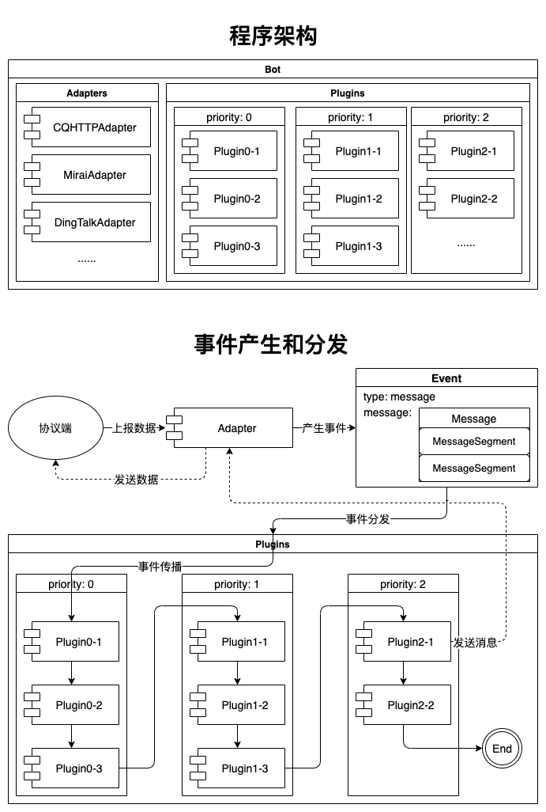

# 简介

AliceBot 是一个简单的 Python 异步多后端机器人框架，支持多种协议适配，可以轻松地编写易用学习和使用的插件来拓展其功能。

## 渐进式框架

AliceBot 是一个渐进式框架，如果你了解 [Vue](https://cn.vuejs.org/guide/introduction.html#the-progressive-framework)，或许已经了解这个概念。

AliceBot 在设计时非常注重易于入门、灵活性和“可以被逐步集成”这个特点。这意味着 AliceBot 大部分的功能都是可选的，您只需要了解很少的相关知识即可开始使用，随着项目规模的扩大和复杂性的增加，您可以继续深入需要的特性，而不需要一开始就掌握全部的特性。

除此之外，尽管 AliceBot 的定位是一个 Python 异步多后端机器人**框架**，但它也可以作为一个**库**集成进你现有的应用，配置文件和单独的插件文件都是可选的，你完全可以“程序式”地管理配置和加载插件。

正如 Vue 的文档中说的：“它是一个可以与你共同成长、适应你不同需求的框架。”

## 完全异步

AliceBot 基于 Python 的异步 I/O ([asyncio](https://docs.python.org/zh-cn/3/library/asyncio.html))，具有优秀的性能表现，可以轻松处理大量请求。

不过不用担心，即使你之前不了解 Python 的异步语法也没什么关系，相信只要基本了解 `async def` 和 `await` 语法，你就可以跟上本指南。

## 完整类型注解

AliceBot 具有完整的类型注解 (Type Hint) 支持，可以基本通过 Pyright (VSCode Pylance 的后端) 严格模式检查。可以充分利用编辑器 / IDE 的类型检查功能和自动提示，有效提高使用体验，减少错误。

## 它是如何工作的？

AliceBot 在使用时，首先需要你实例化一个 `Bot` 对象，`Bot` 对象负责加载配置文件，维护一个插件列表和一个适配器列表并提供了一个供适配器使用的通用的事件分发方法。

协议适配器 (`Adapter`) 负责和协议后端进行通讯，当协议后端发送一个新的事件 (`Event`) 给适配器后，适配器会按插件优先级分发事件给各个插件进行处理。

插件 (`Plugin`) 是由你编写的用于处理事件的类，它必须具有两个方法，`rule()` 和 `handle()`，`rule()` 方法要求返回一个 bool 值，表示当前事件是否要交由此插件处理，当 `rule()` 方法返回 True 时，`handle()` 方法会被调用以进行事件处理。

